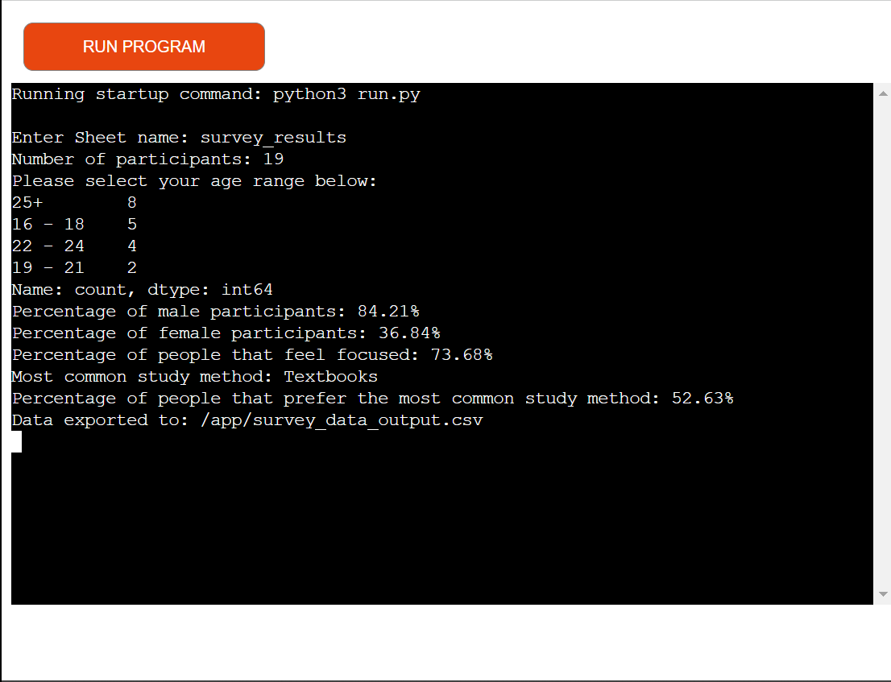

<!-- omit in toc -->
# Student Survey Results

The Student Survey application was created as my third portfolio project for Code Institute's Diploma in Fullstack Software Development.

Deployed site: [Student Survey Application](https://student-survey-5a3849e30a71.herokuapp.com/)

---

<!-- omit in toc -->
## Table of Contents

- [User Experience](#user-experience)
  - [Project Goals](#project-goals)
  - [User Stories](#user-stories)
- [Features](#features)
- [Technologies Used](#technologies-used)
  - [Languages Used](#languages-used)
  - [Libraries, Programs and Packages Used](#libraries-programs-and-packages-used)
- [Deployment and Local Development](#deployment-and-local-development)
  - [Deployment](#deployment)
  - [Local Development](#local-development)
- [Testing](#testing)
  - [Automated Testing](#automated-testing)
  - [Testing User Stories](#testing-user-stories)
  - [Further Testing](#further-testing)
  - [Bugs](#bugs)
    - [Solved Bugs](#solved-bugs)
    - [Known Bugs](#known-bugs)
- [Credits](#credits)
  - [Code](#code)
  - [Content](#content)
  - [Acknowledgements](#acknowledgements)

---

## User Experience

### Project Goals

The primary goal of this portfolio project is to create a Student Survey Application that aligns with the assessment criteria in Code Institute's assessment guide. 
Another goal for this project was to develop an automated analysis process to extract valuable insights from the collected data. The project aims to provide 'college administrators' with actionable information to enhance the learning environment and improve overall student satisfaction.

### User Stories

<!-- omit in toc -->
#### Visitor Goals

This application was designed for college administration and management, therefore first time, frequent and returning vistor goals are the same. Some of these goals are:

- Create a user friendly platform.
- Collect and analyze student feedback from surveys.
- Provide insights for college improvement.

## Features

The features in this application are:

- Data Analysis: The application provides data analysis to help interpret survey results effectively.
- Real-time Data Collection: Survey responses are collected and stored in real-time, allowing for instant data analysis.
- Data Export: Survey results can be exported as a CSV file, for further analysis and reporting.
- Data-driven Insights: The application generates insights based on survey data, helping the college make decisions for improvement.

<!-- omit in toc -->
#### Future Implementations

In future implementations I would like to do the following:

- User Role Management: Implement role-based access control allowing different users, such as professors, administrators, managers and students. 
- Survey Comment Section: Add a comment section to the surveys, allowing students to provide additional feedback.
- Multi-Language Support: Implement multi-language support to cater to all students as so far the survey/s are only in English. 
- Custom Reporting: Allow administrators to create custom reports and dashboards for a more tailored analysis of survey data.
- Enhanced Data Export: Offer more export options, such as different file types.

## Technologies Used

### Languages Used

Python.

### Libraries, Programs and Packages Used

1. [Git](https://git-scm.com/): For version control.
2. [Github](https://github.com/): GitHub was used to store and save the
   projects code after being pushed from Git.
3. [PIP](https://pypi.org/project/pip/)
4. [Click](https://click.palletsprojects.com/en/8.1.x/)
5. [Google-Auth](https://pypi.org/project/google-auth/)
6. [Gspread](https://docs.gspread.org/en/v5.12.0/)
7. [Gspread-Pandas](https://pypi.org/project/gspread-pandas/)
8. [Pandas](https://pandas.pydata.org/)

## Deployment and Local Development

### Deployment

The project was deployed to Heroku using the following steps:

1. Go to [Heroku](https://www.heroku.com/), make sure to have an account set up and log in.
2. From the dashboard click on "Create a new app".
3. Name your app (each app name has to be unique) and set your region. When you've done that you can click the purple "Create app" button.
4. Select settings from the navigation bar for your app, scroll to the "Reveal config vars" button and click it.
5. In the config vars section for the "key" you want to type in "CREDS" and for the value you want to copy and paste your "creds.json" file. We do this because cred.json is in our .gitignore file as it is sensitive data and in order for our app to run from Heroku we need our creds. When you have done that you can click "Add".
6. In the settings section, scroll to "Buildpacks" and click "Add buildpack". The first one you should add is python, the second is nodejs. Make sure after you save your changes that python is on top with nodejs underneath.
7. In the navigation bar for your app select "Deploy".
8. Connect your Github account to Heroku.
9. Search for your Github repository name and click "Connect".
10. You can choose to set up automatic deploys or manual deploy. With automatic deploys Heroku will rebuild your app everytime you make a commit to Github.

### Local Development

<!-- omit in toc -->
#### Forking the Github Repository

Forking a GitHub repository is making a copy of the original on our account.
We can view/edit without affecting the original repository. Follow the steps
below to do this:

1. Log into [Github](https://github.com/)
2. Locate and click on the GitHub Repository for the project you want to fork.
3. Just below the navigation bar for the repository you will see 'fork'. Click on it will take you to a new page with the title 'Create a new fork'.
4. On that page make sure the owner is set to your profile and then type in the name you want to give the repository. 
5. Scroll to the end of the page and in the bottom right hand corner you will see a green button that says 'Create fork', if you click that you should now have a copy of the orginal repository on your Github account.

<!-- omit in toc -->
#### Making a Local Clone

1. Log into [Github](https://github.com/)
2. Locate the GitHub repository for the project you want to clone.
3. Locate and click on the green 'code' button. This should be just below the
   'settings'.
4. Choose whether you would like to clone with 'HTTPS', 'SSH' or 'GitHub CLI'.
5. Copy the link after you select one of the options above.
6. Open the terminal for your code editor and change the current working
   directory to the location where you want the cloned directory to be made.
7. Type 'git clone' into the terminal followed by the link you copied in Step 5
   (paste the link into terminal).
8. Set up a virtual environment.
9. Install the packages in the requirements.txt file using the following command: 'pip3 install -r requirements.txt'

## Testing

I tested the code constantly when making changes or adding things to it using the terminal in Codeanywhere. This proved well as there were bugs that I wasn't aware of.

### Automated Testing

I couldn't find a good python validator online that didn't throw an error because of my imports. I am therefore relying on pylint within my IDE to make sure that my code follows the PEP8 standards.

### Testing User Stories

As I mentioned in my User Stories section this application was designed for college administration and management. Therefore first time, frequent and returning vistor goals are the same.

- Create a user friendly platform: This is done by the terminal prompting the user for the name of the survey sheet that they want insights for. Once they type in the survey sheet name and press enter, all the valuable insighs will be displayed.
- Collect and analyze student feedback from surveys: This is done by implementing a system for collecting, storing and analyzing survey responses.
- Provide insights for college improvement: The collected feedback is translated into actionable insights. This helps the college to indentify areas of improvement, enhance the learning experience and make data-driven decisions.

### Bugs

#### Solved Bugs

- My Google Sheet would not connect to my run.py file: My original credentials wouldn't work so I deleted them and created new credentials. My Google Sheet connected with the new credentials.
- Pylint kept throwing an error for line 176 in run.py as I didn't pass any arguments to the analyze function: I added in a comment on line 174 ("# pylint: disable=no-value-for-parameter") and that fixed the issue.
- My analyze function wouldn't create a new output CSV file in the directory: I deleted the code that was suppose to do that and started from the beginning. It fixed the issue so it was probably a typo that I couldn't see.

#### Known Bugs

I don't currently know of any bugs that exist. If I do end up finding any I will add them here.

## Credits

### Code

The code from line 10-17 in my run.py file is from the Love Sandwiches Essential Project.

### Content

The content is from:

- [My Google Forms Survey](https://docs.google.com/forms/d/18yemi__SOtJBqS-ZdNPh2i32FlfCwcDPYfgXct8OU3c/edit?pli=1)
- My Google Sheet that I created for the survey responses.

### Acknowledgements

I would like to acknowledge the Code Institute Slack channel for their knowledge on Python functions as I was struggling to understand them. I undrstand them a lot more now.